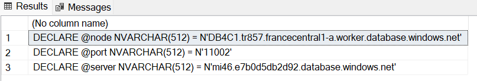
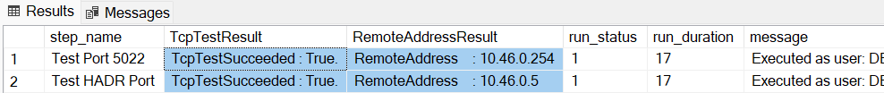

# How-to test failover group connectivity between primary and secondary SQL Managed Instances

When you set up a [failover group](https://docs.microsoft.com/azure/azure-sql/database/auto-failover-group-overview) between primary and secondary SQL Managed Instances in two different regions, each instance is isolated using an independent virtual network. Replication traffic needs to be allowed between these VNets.

To allow this kind of traffic, one of the [prerequisites](https://docs.microsoft.com/azure/azure-sql/database/auto-failover-group-overview?tabs=azure-powershell#enabling-geo-replication-between-managed-instances-and-their-vnets) is:

-  "You need to set up your Network Security Groups (NSG) such that ports **5022** and the range **11000-11999** are open **inbound** and **outbound** for connections from the subnet of the other managed instance. This is to allow replication traffic between the instances."

## Strategy

We can use SQL Agent, available on SQL Managed Instance, to run some failover group related connectivity tests between both instances.

The following script will create a new job on SQL Agent named TestFoGConnection and add 2 steps, one to test port 5022 and another to test HADR port.

Proper values for some parameters need to be specified (@server, @node and @port), but we also have a query to generate them.

The script will trigger the job and check status every 5 seconds until it completes.

You’ll need to run the following steps twice, so you can test connectivity in both ways.

## Steps

1. Connect to secondary instance.

2. Run the following script to generate parameters:

   ```sql
   SELECT 'DECLARE @server NVARCHAR(512) = N'''+ value + ''''
   FROM sys.dm_hadr_fabric_config_parameters
   WHERE parameter_name  = 'DnsRecordName'
   UNION
   SELECT 'DECLARE @node NVARCHAR(512) = N'''+ NodeName + '.' + Cluster + ''''
   FROM 
       (SELECT REPLACE(fr.node_name,'.','') AS NodeName, JoinCol = 1
   FROM sys.dm_hadr_fabric_partitions fp
   JOIN sys.dm_hadr_fabric_replicas fr ON fp.partition_id = fr.partition_id
   JOIN sys.dm_hadr_fabric_nodes fn ON fr.node_name = fn.node_name
   WHERE service_name like '%ManagedServer%' and replica_role = 2) t1
   LEFT JOIN
       (SELECT value as Cluster, JoinCol = 1
   FROM sys.dm_hadr_fabric_config_parameters
   WHERE parameter_name  = 'ClusterName') t2
   ON (t1.JoinCol = t2.JoinCol)
   UNION
   SELECT 'DECLARE @port NVARCHAR(512) = N'''+ value + ''''
   FROM sys.dm_hadr_fabric_config_parameters
   WHERE parameter_name = 'HadrPort';
   ```

You will get something like:

   

Save the result to be used in next steps. Note that the parameters we just generated may change after any reconfiguration, be sure to generate them again if needed.

3. Now that we know what endpoints on secondary instance should we test against, let's connect to primary instance.

4. Paste the following script

   ```sql
   --START
   -- Parameters section
   DECLARE @node NVARCHAR(512) = N' '
   DECLARE @port NVARCHAR(512) = N' '
   DECLARE @server NVARCHAR(512) = N' '
   
   --Script section
   IF EXISTS (SELECT job_id FROM msdb.dbo.sysjobs_view WHERE name = N'TestFoGConnection')
   EXEC msdb.dbo.sp_delete_job @job_name=N'TestFoGConnection', @delete_unused_schedule=1
   
   DECLARE @jobId BINARY(16), @cmd NVARCHAR(MAX)
   
   EXEC  msdb.dbo.sp_add_job @job_name=N'TestFoGConnection', @enabled=1, @job_id = @jobId    OUTPUT
   
   SET @cmd = (N'tnc ' + @server + N' -port 5022 | select ComputerName, RemoteAddress,    TcpTestSucceeded | Format-List')
   EXEC msdb.dbo.sp_add_jobstep @job_id=@jobId, @step_name=N'Test Port 5022'
   , @step_id=1, @cmdexec_success_code=0, @on_success_action=3, @on_fail_action=3
   , @subsystem=N'PowerShell', @command=@cmd, @database_name=N'master'
   
   SET @cmd = (N'tnc ' + @node + N' -port ' + @port +' | select ComputerName,    RemoteAddress, TcpTestSucceeded | Format-List')
   EXEC msdb.dbo.sp_add_jobstep @job_id=@jobId, @step_name=N'Test HADR Port'
   , @step_id=2, @cmdexec_success_code=0, @subsystem=N'PowerShell', @command=@cmd,    @database_name=N'master'
   
   EXEC msdb.dbo.sp_add_jobserver @job_id = @jobId, @server_name = N'(local)'
   GO
   EXEC msdb.dbo.sp_start_job @job_name=N'TestFoGConnection'
   GO
   --Check status every 5 seconds
   DECLARE @RunStatus INT 
   SET @RunStatus=10
   WHILE ( @RunStatus >= 4)
   BEGIN
   SELECT distinct @RunStatus  = run_status
   FROM [msdb].[dbo].[sysjobhistory] JH JOIN [msdb].[dbo].[sysjobs] J ON JH.job_id= J.   job_id 
   WHERE J.name=N'TestFoGConnection' and step_id = 0
   WAITFOR DELAY '00:00:05'; 
   END
   
   --Get logs once job completes
   SELECT [step_name]
   ,SUBSTRING([message], CHARINDEX('TcpTestSucceeded',[message]), CHARINDEX('Process Exit',   [message])-CHARINDEX('TcpTestSucceeded',[message])) as TcpTestResult
   ,SUBSTRING([message], CHARINDEX('RemoteAddress',[message]), CHARINDEX   ('TcpTestSucceeded',[message])-CHARINDEX('RemoteAddress',[message])) as    RemoteAddressResult
   ,[run_status] ,[run_duration], [message]
   FROM [msdb].[dbo].[sysjobhistory] JH JOIN [msdb].[dbo].[sysjobs] J ON JH.job_id= J.   job_id
   WHERE J.name=N'TestFoGConnection' and step_id <> 0
   --END
   ```
 5. Replace the parameters with the values you got from step #2, like:
   
   ```sql
   --START
   -- Parameters section
   DECLARE @node NVARCHAR(512) = N'DB80C1.tr1234.francecentral1-a.worker.database.windows.net'
   DECLARE @port NVARCHAR(512) = N'11002'
   DECLARE @server NVARCHAR(512) = N'mi46.abcd5db2d92.database.windows.net'
   ```

6. Run the script and check the results, you will get something like:

   

   Verify the results:
   - The outcome of each test at TcpTestSucceeded should be *TcpTestSucceeded : True*.  
   - Check if the resolved IP Address matches the range for the destination subnet, goal is to spot bad DNS resolution (like missing or wrong value). 


## Now, let's run the same test, but in the opposite direction

You just tested the connectivity from the primary against the secondary. We need to do the same the other way around. 

Repeat the previous steps but now connect to primary to generate the parameters and then use those parameters to run the test from the secondary instance to confirm that secondary can also reach primary instance on those endpoints.

## Next steps

In case there's any test failing (*TcpTestSucceeded : False*), this is usually a client-side networking issue (like DNS issue or a port being blocked) that you will need to pursue with your local network administrator.

We strongly recommend you request assistance from your network administrator, some validations you may do together are:

- The Network Security Groups (NSG) on the **primary** managed instance subnet allows:
   - **Inbound** access on ports 5022 and the range 11000-11999
   - **Outbound** access on ports 5022 and the range 11000-11999

- The Network Security Groups (NSG) on the **secondary** managed instance subnet allows:
   - **Inbound** access on ports 5022 and the range 11000-11999
   - **Outbound** access on ports 5022 and the range 11000-11999

- The two SQL Managed Instance VNets do not have overlapping IP addresses.

- Any networking device used (like firewalls, NVAs) do not block the traffic mentioned above.

- Routing is properly configured, and asymmetric routing is avoided. 

- If you are using virtual network peering between different regions, ensure that **global virtual network peering** is supported. See more at [Enabling geo-replication between managed instance virtual networks](https://docs.microsoft.com/en-us/azure/azure-sql/database/auto-failover-group-overview?tabs=azure-powershell#enabling-geo-replication-between-managed-instances-and-their-vnets)

- If you are using peering via VPN gateway, ensure the two virtual networks are properly peered.
