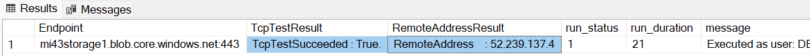

# How-to test TCP connectivity from a SQL Managed Instance

There are scenarios where it would be nice to be able to test if a SQL Managed Instance can reach some "external" endpoints, like Azure Storage as an example.

## Strategy

We can use SQL Agent, available on SQL Managed Instance, to run connectivity tests from the instance itself.

The following script will create a new job on SQL Agent named TestTCPNetworkConnection and add a step to test TCP connection against an endpoint (and port) you specify.

Proper values for @endpoint and @port need to be specified.

The script will trigger the job and check status every 5 seconds until it completes.

## Steps

1. Connect to the instance.

2. Paste the following script on a query window:

   ```sql
   --START
   -- Parameters
   DECLARE @endpoint NVARCHAR(512) = N'mi43storage1.blob.core.windows.net'
   DECLARE @port NVARCHAR(5) = N'443'
   
   --Script
   DECLARE @jobName NVARCHAR(512) = N'TestTCPNetworkConnection', @jobId BINARY(16), @cmd    NVARCHAR(MAX)
   IF EXISTS (SELECT job_id FROM msdb.dbo.sysjobs_view WHERE name = @jobName)
   EXEC msdb.dbo.sp_delete_job @job_name=@jobName, @delete_unused_schedule=1
   EXEC msdb.dbo.sp_add_job @job_name=@jobName, @enabled=1, @job_id = @jobId OUTPUT
   DECLARE @stepName NVARCHAR(512) = @endpoint + N':' + @port
   SET @cmd = (N'tnc ' + @endpoint + N' -port ' + @port +' | select ComputerName,    RemoteAddress, TcpTestSucceeded | Format-List')
   EXEC msdb.dbo.sp_add_jobstep @job_id=@jobId, @step_name=@stepName
   , @step_id=1, @cmdexec_success_code=0, @subsystem=N'PowerShell', @command=@cmd,    @database_name=N'master'
   
   EXEC msdb.dbo.sp_add_jobserver @job_id = @jobId, @server_name = N'(local)'
   EXEC msdb.dbo.sp_start_job @job_name=@jobName
   
   --Check status every 5 seconds
   DECLARE @RunStatus INT 
   SET @RunStatus=10
   WHILE ( @RunStatus >= 4)
   BEGIN
   SELECT distinct @RunStatus  = run_status
   FROM [msdb].[dbo].[sysjobhistory] JH JOIN [msdb].[dbo].[sysjobs] J ON JH.job_id= J.   job_id 
   WHERE J.name=@jobName and step_id = 0
   WAITFOR DELAY '00:00:05'; 
   END
   
   --Get logs once job completes
   SELECT [step_name] AS [Endpoint]
   ,SUBSTRING([message], CHARINDEX('TcpTestSucceeded',[message]), CHARINDEX('Process Exit',   [message])-CHARINDEX('TcpTestSucceeded',[message])) as TcpTestResult
   ,SUBSTRING([message], CHARINDEX('RemoteAddress',[message]), CHARINDEX   ('TcpTestSucceeded',[message])-CHARINDEX('RemoteAddress',[message])) as    RemoteAddressResult
   ,[run_status] ,[run_duration], [message]
   FROM [msdb].[dbo].[sysjobhistory] JH JOIN [msdb].[dbo].[sysjobs] J ON JH.job_id= J.   job_id
   WHERE J.name=@jobName and step_id <> 0
   --END
   ```

3. Set desired values for *@endpoint* and *@port* on the *parameters* section of the script.

4. Run the script and check the results, you will get something like:

   

   Verify the results:
   - The outcome of each test at TcpTestSucceeded should be *TcpTestSucceeded : True*.  
   - Check if the resolved IP Address to spot bad DNS resolution (like missing or wrong value).

## Next steps

In case the test is failing (*TcpTestSucceeded : False*), this is usually a client-side networking issue (like DNS issue or a port being blocked) that you will need to pursue with your local network administrator.
